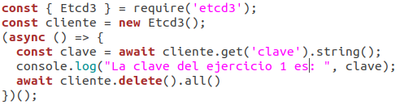
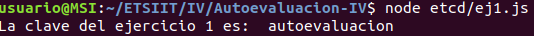
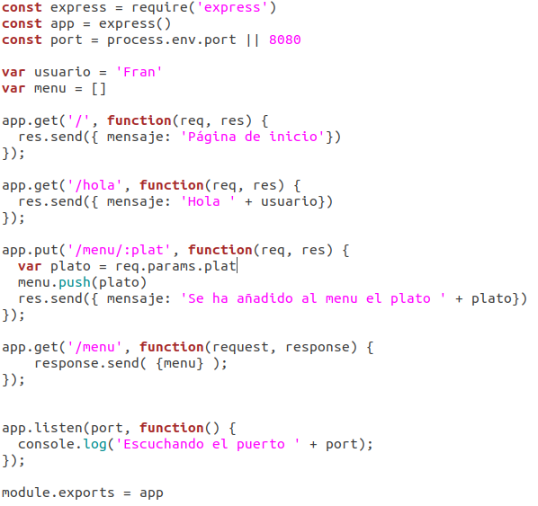
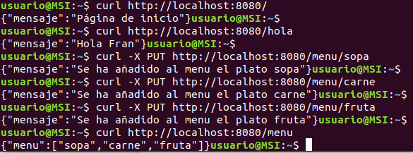
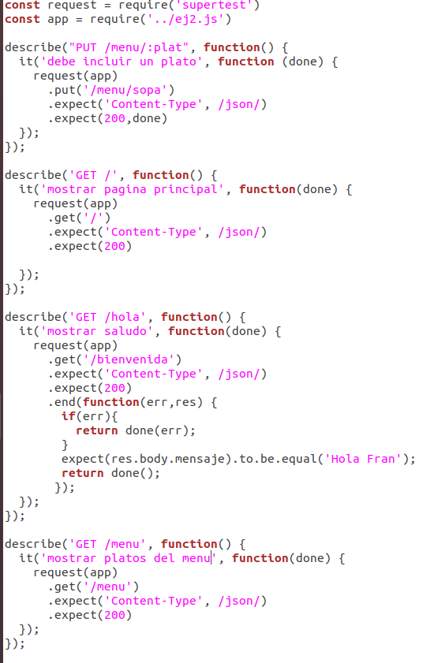
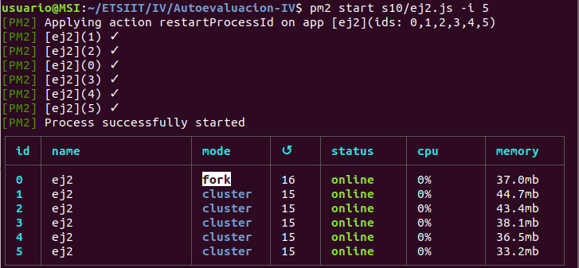

# Autoevaluación semana 10

## 1. Instalar etcd3, averiguar qué bibliotecas funcionan bien con el lenguaje que estemos escribiendo el proyecto (u otro lenguaje), y hacer un pequeño ejemplo de almacenamiento y recuperación de una clave; hacer el almacenamiento desde la línea de órdenes (con etcdctl) y la recuperación desde el mini-programa que hagáis.

Una vez tenemos instalado etcd y hecho *export ETCDCTL_API=3*, procedemos a guardar nuestra clave:
~~~
etcdctl put clave autoevaluacion
~~~

La biblioteca que vamos a usar para node es etcd3. Para el ejemplo de almacenamiento de la clave creamos el siguiente [programa](../s10/ej1.js):

Ejecutamos desde el terminal y vemos la clave:

## 2-3. Realizar una aplicación básica que use express para devolver alguna estructura de datos del modelo que se viene usando en el curso. Programar un microservicio en express (o el lenguaje y marco elegido) que incluya variables como en el caso anterior.

Tras instalar express, creamos nuestra [aplicación](../s10/ej2.js):

En ella mostramos la pagina de inicio, una página de saludo, añadir un plato al menú y mostrar el menú:

## 4.  Crear pruebas para las diferentes rutas de la aplicación.

Incluimos un fichero de [tests](../s10/test/ej2.test.js):

## 5.  Experimentar con diferentes gestores de procesos y servidores web front-end para un microservicio que se haya hecho con antelación, por ejemplo en la sección anterior.

Instalamos pm2 y probamos:

## 6.  Usar rake, invoke o la herramienta equivalente en tu lenguaje de programación para programar diferentes tareas que se puedan lanzar fácilmente desde la línea de órdenes.

Para ello añadimos script a package.json
