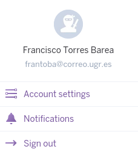
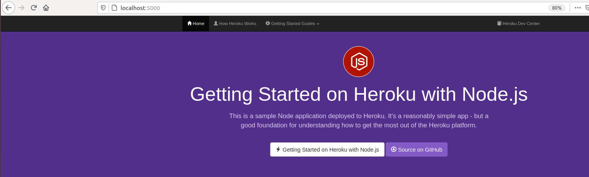
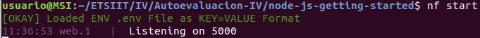

# Autoevaluación semana 13

## 1. Darse de alta en algún servicio PaaS tal como Heroku o BlueMix o usar alguno de los PaaS de otros servicios cloud en los que ya se esté dado de alta.

## 2-3. Crear una aplicación en OpenShift o en algún otro PaaS en el que se haya dado uno de alta. Realizar un despliegue de prueba usando alguno de los ejemplos incluidos con el PaaS. Instalar y echar a andar tu primera aplicación en Heroku.

Clonamos repositorio:
~~~
git clone https://github.com/heroku/node-js-getting-started.git
~~~

Instalamos, nos logueamos y creamos aplicación:
~~~
sudo snap install heroku --classic
heroku login
heroku create
~~~

## 4.  Usar como base la aplicación de ejemplo de heroku y combinarla con la aplicación en node que se ha creado anteriormente. Probarla de forma local con foreman. Al final de cada modificación, los tests tendrán que funcionar correctamente; cuando se pasen los tests, se puede volver a desplegar en heroku.

~~~
npm install -g foreman
npm install express --save
nf start
~~~

