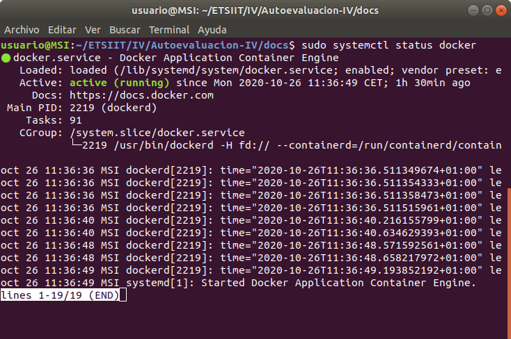
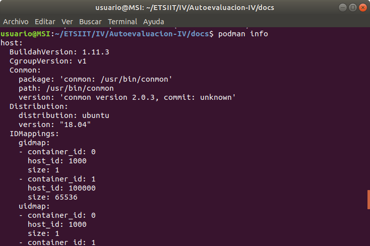
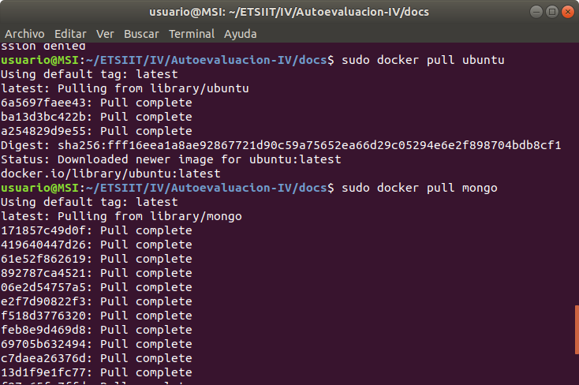
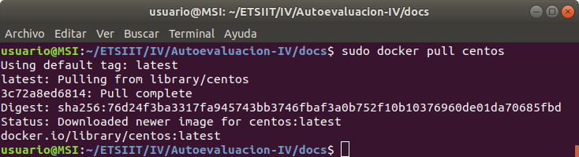
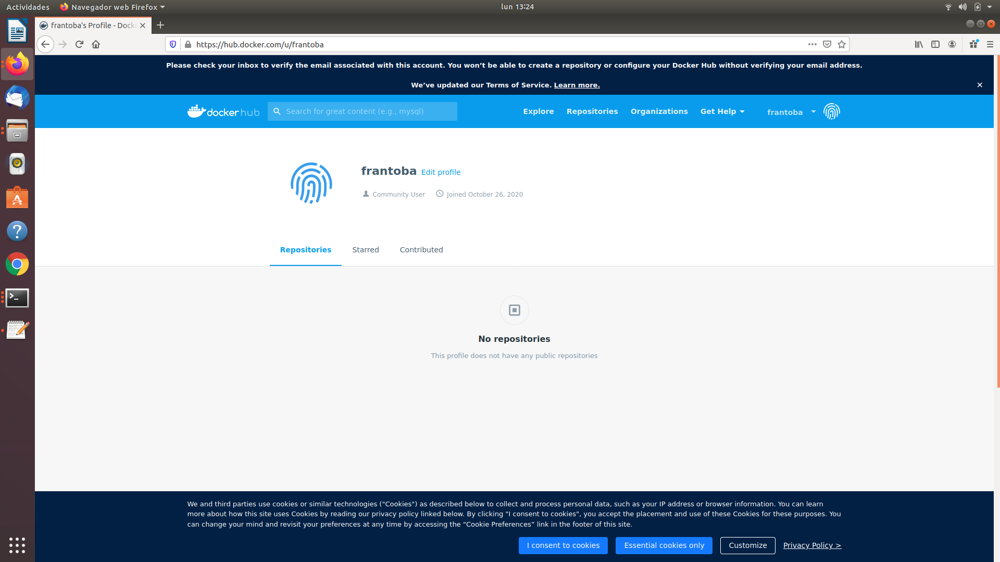

# Autoevaluación semana 4

## 1. Instalar docker y/o otro gestor de contenedores como Podman/Buildah.

Para la instalación en ubuntu he seguido los siguientes pasos:

~~~
$ sudo apt update
$ sudo apt install apt-transport-https ca-certificates curl software-properties-common
$ curl -fsSL https://download.docker.com/linux/ubuntu/gpg | sudo apt-key add -
$ sudo add-apt-repository "deb [arch=amd64] https://download.docker.com/linux/ubuntu focal stable"
$ sudo apt update
$ apt-cache policy docker-ce
$ sudo apt install docker-ce
~~~

Para la instalacción de Podman:
~~~
$ apt-get install software-properties-common -y
$ add-apt-repository -y ppa:projectatomic/ppa
$ apt-get install podman -y
~~~

## 2.Instalar a partir de docker una imagen alternativa de Ubuntu y alguna adicional, por ejemplo de CentOS.
## Buscar e instalar una imagen que incluya MongoDB.

## 3. Creación usuario DockerHub

