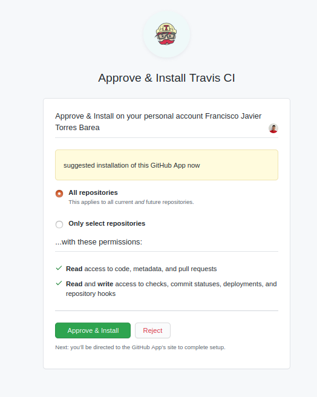
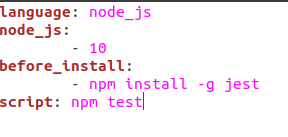
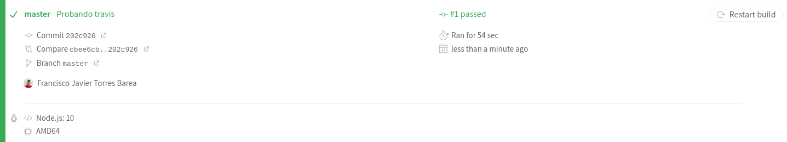
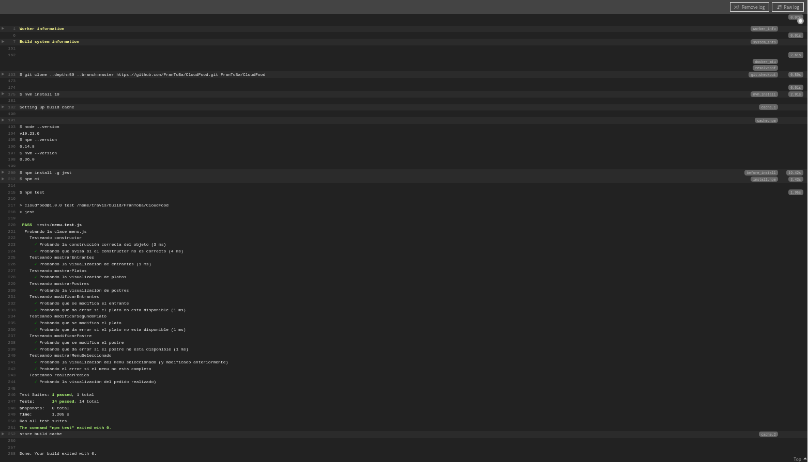

# Autoevaluación semanas 5 y 6

## 9. Haced los dos primeros pasos antes de pasar al tercero.
~~~
- Darse de alta. Muchos están conectados con GitHub por lo que puedes autentificarte directamente desde ahí. A través de un proceso de autorización, puedes acceder al contenido e incluso informar del resultado de los tests a GitHub.

- Activar el repositorio en el que se vaya a aplicar la integración continua. Travis permite hacerlo directamente desde tu configuración; en otros se dan de alta desde la web de GitHub.

- Crear un fichero de configuración para que se ejecute la integración y añadirlo al repositorio.
~~~

1. Para empezar, accedemos a la [página de Travis](https://travis-ci.com/signin) y nos logueamos usando nuestra cuenta de GitHub.

2. Activamos nuestros repositorios

3. Crear fichero de configuración.

## 10. Ejercicio 10: Configurar integración contínua para nuestra aplicación usando Travis o algún otro sitio.

Una vez añadido el archivo .travis.yml a nuestro repositorio, se ejecuta travis cada vez que hacemos push.

Como vemos se ejecutan los tests:

