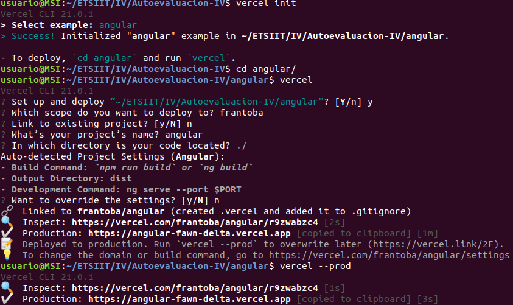
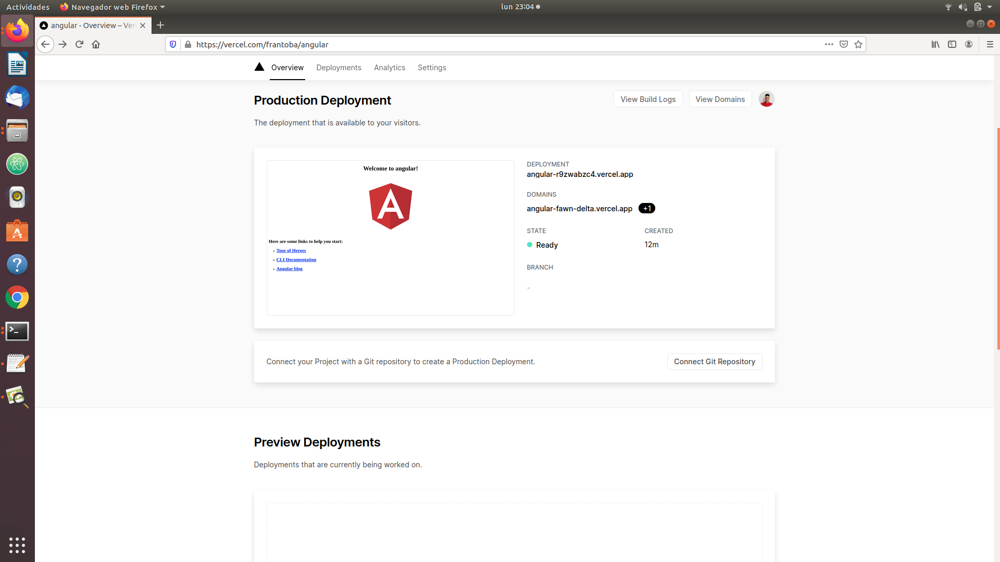
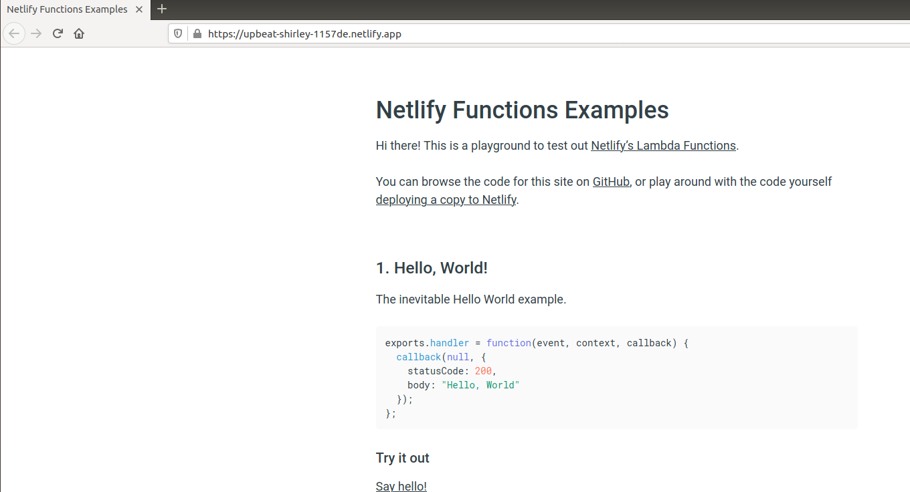

# Autoevaluación semana 8-9

## 1. Darse de alta en Vercel y Firebase, y descargarse los SDKs para poder trabajar con ellos localmente.

Para Vercel nos registramos usando GitHub y para FireBase nuestra cuenta go.ugr.
Para los sdks:
~~~
$ npm install -g vercel
$ npm install -g firebase-tools
~~~

## 2. Tomar alguna de las funciones de prueba de Vercel, y hacer despliegues de prueba con el mismo.
Con vercel init seguimos los pasos indicados:

## 3. Tomar alguna de las funciones de prueba de Netlify, y hacer despliegues de prueba con el mismo.
Iniciamos sesión con nuesta cuenta de github.
- A través de este [enlace](https://app.netlify.com/start/deploy?repository=https://github.com/netlify/netlify-functions-example), seguimos los pasos. Como no hemos configurado dominio, usamos uno que nos generan.

